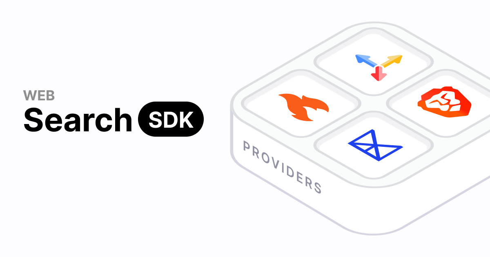

<div align="center">



# websearch-sdk

**A unified web search SDK to plug into AI agents.**

Swap search/scrape providers without touching your app code, and hand framework-native tools straight to your agent.

</div>

---

## Table of contents

- [Why](#why)
- [Features](#features)
- [Installation](#installation)
- [Quick start](#quick-start)
- [Usage](#usage)
  - [Search](#search)
  - [Scrape](#scrape)
  - [Tools for AI frameworks](#tools-for-ai-frameworks)
- [Providers](#providers)
  - [Provider examples](#provider-examples)
- [Unified types](#unified-types)
- [Architecture](#architecture)
- [Local development](#local-development)
- [Adding a provider](#adding-a-provider)
- [License](#license)

## Why

Every web-search / scrape provider has a different API shape, auth scheme, and response format — and every agent framework has its own tool format. You end up rewriting glue for each combination.

`websearch-sdk` normalizes both sides:

- **Unified output** — `search()` and `scrape()` always return the same shape, regardless of provider.
- **Plug-and-play providers** — one small factory per provider; switch providers by changing a single line.
- **Framework adapters** — turn the unified capabilities into framework-native tools via `web.tools()`.

## Features

- 🔌 **Pluggable providers** — Firecrawl, Tavily, Exa, Brave, Serper (more easy to add).
- 🧱 **Always-unified results** — identical `SearchResult` / `ScrapeResult` across every provider.
- 🤖 **Agent-ready tools** — `web.tools()` returns a Vercel AI SDK `ToolSet` (`web_search` + `web_scrape`).
- 🎛️ **Capability-aware** — scrape tools/methods are only exposed when the provider supports them.
- 🪶 **Lightweight** — providers use native `fetch`, no heavy SDK dependencies.
- 📦 **ESM + CJS + types** — ships dual builds with full TypeScript declarations.

## Installation

Install the core package plus whichever provider you need:

```bash
# pnpm
pnpm add @search-sdk/core @search-sdk/firecrawl

# npm
npm install @search-sdk/core @search-sdk/firecrawl

# yarn
yarn add @search-sdk/core @search-sdk/firecrawl
```

The **Vercel AI SDK adapter is built into core** and is the default for `web.tools()`. To use tools, also install `ai` (v5) — it's an optional peer dependency of core:

```bash
pnpm add ai
```

> Requires Node.js 18+ (uses the global `fetch`).

## Quick start

```ts
import { WebSearch } from "@search-sdk/core";
import { firecrawl } from "@search-sdk/firecrawl";

const web = new WebSearch({
  // apiKey is optional — falls back to the FIRECRAWL_API_KEY env var
  provider: firecrawl(),
});

// Direct, unified API
const results = await web.search({ query: "latest TypeScript release" });
const page = await web.scrape({ url: "https://example.com" });

// Or hand tools to an agent — defaults to the built-in AI SDK adapter
const tools = web.tools(); // -> { web_search, web_scrape }
```

## Usage

### Search

```ts
const res = await web.search({
  query: "best TypeScript monorepo tools",
  maxResults: 5,
  includeDomains: ["github.com"],
  timeRange: "month",
  includeContent: true, // pull page content into each result (when supported)
});

for (const r of res.results) {
  console.log(r.title, r.url, r.snippet);
}

// A bare string works too:
await web.search("typescript 5.7 release notes");
```

### Scrape

```ts
const page = await web.scrape({
  url: "https://example.com/article",
  formats: ["markdown"],
  onlyMainContent: true,
});

console.log(page.title);
console.log(page.markdown);
```

`scrape()` throws a `WebSearchError` if the active provider doesn't support scraping (e.g. Brave, Serper).

### Tools for AI frameworks

`web.tools()` returns a Vercel AI SDK `ToolSet` you can pass straight into `generateText` / `streamText`. The **AI SDK adapter is built into core and used by default** — no extra package or `framework` option required. `web_scrape` is included only when the provider supports it.

```ts
import { generateText, stepCountIs } from "ai";
import { openai } from "@ai-sdk/openai";

const { text } = await generateText({
  model: openai("gpt-4o-mini"),
  tools: web.tools(), // default AI SDK tools
  stopWhen: stepCountIs(5),
  prompt: "Find the latest stable pnpm version and summarize what changed.",
});
```

To customize tool names/descriptions, import `aiSdk` from core and pass it as the `framework`:

```ts
import { WebSearch, aiSdk } from "@search-sdk/core";

const web = new WebSearch({
  provider: firecrawl(),
  framework: aiSdk({
    searchToolName: "search_the_web",
    scrapeToolName: "read_url",
    searchDescription: "Search the public web for current information.",
  }),
});
```

### Custom frameworks

`framework` accepts any object implementing the `FrameworkAdapter` contract, so you can target other agent frameworks while reusing the same provider:

```ts
import type { FrameworkAdapter } from "@search-sdk/core";

const myAdapter: FrameworkAdapter = {
  name: "my-framework",
  createTools({ web, provider }) {
    return {
      /* build your framework's tools from web.search / web.scrape */
    };
  },
};

const web = new WebSearch({ provider: firecrawl(), framework: myAdapter });
```

## Providers

| Package | Search | Scrape | Env variable | Get a key |
| --- | :---: | :---: | --- | --- |
| `@search-sdk/firecrawl` | ✅ | ✅ | `FIRECRAWL_API_KEY` | [firecrawl.dev](https://firecrawl.dev) |
| `@search-sdk/tavily` | ✅ | ✅ (extract) | `TAVILY_API_KEY` | [tavily.com](https://tavily.com) |
| `@search-sdk/exa` | ✅ | ✅ (contents) | `EXA_API_KEY` | [exa.ai](https://exa.ai) |
| `@search-sdk/brave` | ✅ | — | `BRAVE_API_KEY` | [brave.com/search/api](https://brave.com/search/api/) |
| `@search-sdk/serper` | ✅ | — | `SERPER_API_KEY` | [serper.dev](https://serper.dev) |

Every provider factory accepts an optional `{ apiKey?, baseUrl? }`. The rest of your code is identical no matter which one you pick.

### API keys

`apiKey` is optional. If you don't pass one, the provider reads it from its environment variable (shown above):

```ts
// Both are equivalent when FIRECRAWL_API_KEY is set in the environment:
firecrawl();
firecrawl({ apiKey: process.env.FIRECRAWL_API_KEY });
```

If no key is passed and none is found in the environment, the factory throws a `MissingApiKeyError` (a subclass of `WebSearchError`) naming the provider and the env variables it checked:

```ts
import { MissingApiKeyError, isMissingApiKeyError } from "@search-sdk/core";

try {
  const web = new WebSearch({ provider: tavily() });
} catch (err) {
  if (isMissingApiKeyError(err)) {
    console.error(err.message);  // No API key provided for "tavily". ...
    console.error(err.envVars);  // ["TAVILY_API_KEY"]
  }
}
```

### Provider examples

```ts
import { firecrawl } from "@search-sdk/firecrawl";
import { tavily } from "@search-sdk/tavily";
import { exa } from "@search-sdk/exa";
import { brave } from "@search-sdk/brave";
import { serper } from "@search-sdk/serper";

// apiKey is optional — each reads its own env var (e.g. TAVILY_API_KEY) by default.
const providers = {
  firecrawl: firecrawl(),
  tavily: tavily(),
  exa: exa(),
  brave: brave(),
  serper: serper(),
};

// Same downstream code for any provider:
const web = new WebSearch({ provider: providers.tavily });
const res = await web.search("who won the 2026 super bowl?");
console.log(res.answer);      // Tavily/Exa/Serper can return a synthesized answer
console.log(res.results);     // always SearchResult[]
```

Pass provider-specific knobs that aren't part of the unified API through `providerOptions`:

```ts
await web.search({
  query: "rust async runtimes",
  providerOptions: { search_depth: "advanced" }, // forwarded verbatim to the provider
});
```

## Unified types

`search()` resolves to a `SearchResponse`:

```ts
interface SearchResponse {
  query: string;
  provider: string;            // e.g. "firecrawl"
  results: SearchResult[];
  answer?: string;             // synthesized answer when the provider returns one
  images?: { url: string; description?: string }[];
  responseTime?: number;
  raw?: unknown;               // untouched provider payload
}

interface SearchResult {
  title: string;
  url: string;
  snippet?: string;
  content?: string;            // present when includeContent is set
  publishedDate?: string;
  author?: string;
  score?: number;
  favicon?: string;
  image?: string;
  source?: string;
  raw?: unknown;
}
```

`scrape()` resolves to a `ScrapeResult` (`url`, plus optional `title`, `markdown`, `html`, `rawHtml`, `content`, `links`, `screenshot`, `metadata`, `publishedDate`, `author`, `raw`).

Errors are normalized to `WebSearchError` (with `provider` and optional `status`), so you can handle failures uniformly.

## Architecture

```
@search-sdk/core            WebSearch class + unified types + provider contracts
                               + the built-in Vercel AI SDK adapter (default for tools())
@search-sdk/<provider>      firecrawl · tavily · exa · brave · serper
```

**core** is provider-agnostic and ships the AI SDK adapter as the default framework; **providers** depend only on core. You can still pass a custom `framework` adapter to target other agent frameworks. Adding a provider or framework is purely additive.

```
packages/
  core/                      # @search-sdk/core (incl. src/frameworks/ai-sdk.ts)
  providers/
    firecrawl/  tavily/  exa/  brave/  serper/
examples/
  ai-sdk-agent/              # runnable end-to-end demo
```

## Local development

This is a [pnpm](https://pnpm.io) + TypeScript monorepo.

```bash
# 1. Install dependencies
pnpm install

# 2. Build every package (tsup -> ESM + CJS + .d.ts)
pnpm build

# 3. Run the test suite (vitest; network is mocked)
pnpm test
pnpm test:watch

# 4. Type-check all packages
pnpm typecheck
```

### Running the example

```bash
# set the keys you need
export FIRECRAWL_API_KEY=...
export OPENAI_API_KEY=...

pnpm --filter @search-sdk/example-ai-sdk-agent start
```

Swap `firecrawl(...)` for any other provider in `examples/ai-sdk-agent/src/main.ts` and the rest of the code stays identical — that's the core promise.

## Adding a provider

1. Create `packages/providers/<name>` (copy an existing provider's `package.json`, `tsconfig.json`, `tsup.config.ts`).
2. Implement the `SearchProvider` contract from `@search-sdk/core`:
   ```ts
   export function myProvider(opts: { apiKey: string }): SearchProvider {
     return {
       name: "my-provider",
       capabilities: { search: true, scrape: false },
       async search(options) {
         /* call API, return normalizeSearch(...) */
       },
     };
   }
   ```
3. Add a pure `normalize*` function that maps the raw response to the unified types, and unit-test it with a mocked `fetch`.

No changes to core are required — providers are additive.

## License

MIT
